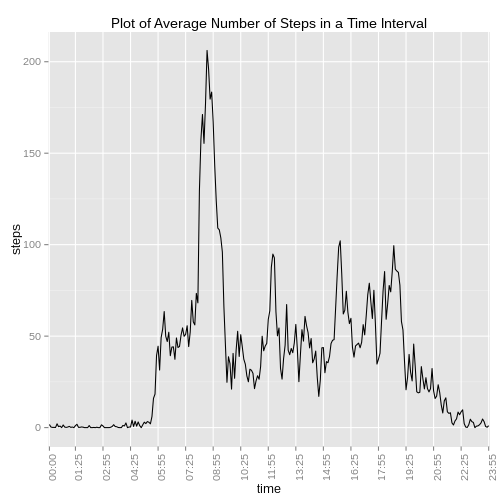
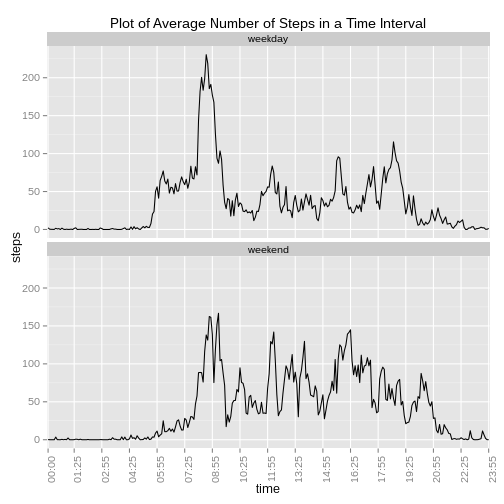

## Reproducible Research: Peer Assessment 1

## Loading and preprocessing the data

Open the specific file (in this case there is only one) in the ZIP file
using *unz()* and read it using *read.csv()*. Note that *read.csv()* leaves
the file connection closed, so an explicit close is not needed.


```r
con <- unz("activity.zip", "activity.csv")
df <- read.csv(con)
```
Before any processing the data needs to be examined. The specific commands
used are not shown here. The important findings (that will be used in 
further processing), are:
- NAs are present for either an entire day, or not at all. That is, either
the entire day's worth of data is missing or none of it.
- The time sequence under the head *interval* is in an odd format, jumping
from *55* to *100*. A more meaningful of representing this would be **hh:mm**.


```r
tapply(is.na(df$steps), df$date, sum)
```

```
## 2012-10-01 2012-10-02 2012-10-03 2012-10-04 2012-10-05 2012-10-06 
##        288          0          0          0          0          0 
## 2012-10-07 2012-10-08 2012-10-09 2012-10-10 2012-10-11 2012-10-12 
##          0        288          0          0          0          0 
## 2012-10-13 2012-10-14 2012-10-15 2012-10-16 2012-10-17 2012-10-18 
##          0          0          0          0          0          0 
## 2012-10-19 2012-10-20 2012-10-21 2012-10-22 2012-10-23 2012-10-24 
##          0          0          0          0          0          0 
## 2012-10-25 2012-10-26 2012-10-27 2012-10-28 2012-10-29 2012-10-30 
##          0          0          0          0          0          0 
## 2012-10-31 2012-11-01 2012-11-02 2012-11-03 2012-11-04 2012-11-05 
##          0        288          0          0        288          0 
## 2012-11-06 2012-11-07 2012-11-08 2012-11-09 2012-11-10 2012-11-11 
##          0          0          0        288        288          0 
## 2012-11-12 2012-11-13 2012-11-14 2012-11-15 2012-11-16 2012-11-17 
##          0          0        288          0          0          0 
## 2012-11-18 2012-11-19 2012-11-20 2012-11-21 2012-11-22 2012-11-23 
##          0          0          0          0          0          0 
## 2012-11-24 2012-11-25 2012-11-26 2012-11-27 2012-11-28 2012-11-29 
##          0          0          0          0          0          0 
## 2012-11-30 
##        288
```

Introduce another column in our data.frame called *time* that converts
*interval* to this format.

The code snippet below takes an entry from *interval* pads it with leading
zeros if necessary and inserts a *":"* after the two least significant digits.


```r
df$time <- formatC(df$interval, width=4, flag = "0",
                                big.mark = ":", big.interval = 2)
```

## What is mean total number of steps taken per day?

Compute the total number of steps subset over *date* to get the total number
of steps per day. We do not need to worry about NAs right now, as the days
with NA are fully NA, so we just get an NA for those results.

Once this is computed, plot a histogram using the *base plotting* system.
The default bin size of the histogram is too large, so nudge it to go to the
next smaller bin size.


```r
steps <- tapply(df$steps, df$date, sum)
hist(steps, main = "Histogram of Total Steps per Day", breaks=8)
```

 

Now compute the mean and median of the *total steps per day* data.


```r
stepMean <- mean(steps, na.rm = TRUE)
stepMedian <- median(steps, na.rm = TRUE)
stepMean
```

```
## [1] 10766.19
```

```r
stepMedian
```

```
## [1] 10765
```

The **Mean** total steps per day is **10766.19**
and the **Median** is **10765**.


## What is the average daily activity pattern?

Compute the daily average steps for all time intervals, ignoring any NAs.


```r
dailyAct <- aggregate(steps ~ time, data = df, mean, na.rm=T)
```

Now plot this using *ggplot2*. Take care of a few points for the sake of
clarity.
- plot *steps* against *time* using a *line graph*.
- reduce the x-axis breaks so that the legend and ticks can be shown 
properly.
- rotate the x-axis legend by 90 degress for legibility
- add a title


```r
library(ggplot2)
g <- ggplot(dailyAct, aes(time, steps))
g <- g + geom_line(aes(group = 1))
g <- g + scale_x_discrete(breaks = dailyAct$time[seq(1, 288, length.out = 17)])
g <- g + theme(axis.text.x = element_text(angle = 90))
g + labs(title = "Plot of Average Number of Steps in a Time Interval")
```

 

Find the index corresponding to the maximum value of steps in *dailyAct*
and then use it find the corresponding *steps* and *interval*. Here, we only
have the computed *time*, so convert it to *interval*.


```r
maxIdx <- which((dailyAct$steps == max(dailyAct$steps)))
maxStep <- dailyAct$steps[maxIdx]
maxInt <- as.integer(gsub(":", "", dailyAct$time[maxIdx]))
```

The maximum number of steps on average is **206.17** in
the interval **835**.

## Imputing missing values

Compute the number of missing values.


```r
missCount <- sum(is.na(df))
missCount
```

```
## [1] 2304
```
The number of missing values is **2304**

#### Strategy for Imputing Missing Data
The approach take for imputing the missing value is to fill an *interval*
with the *mean* of the same intervals from the available values. The list
of such values has already been computed in a previous step and stored in the
data.frame dailyAct. As mentioned in the beginning of this document, the
missing data is for entire days only.
An entire days worth of mean (the one stored in dailyAct) can be simply
assigned to a day's worth of missing data. R's recycling rule will expand
the smaller vector (dailyAct in this case) suitably.

First create a new data.frame and then impute only the *steps* column.


```r
d2 <- df
d2[is.na(d2), "steps"] <- dailyAct$steps
```

Verify that there are no NAs, now.


```r
sum(is.na(d2))
```

```
## [1] 0
```

For creating a histogram of the total number steps taken each day, the same
approach as earlier is taken.


```r
steps2 <- tapply(d2$steps, d2$date, sum)
hist(steps2, main = "Histogram of Total Steps per Day", breaks=8)
```

 

```r
step2Mean <- mean(steps2)
step2Median <- median(steps2)
step2Mean
```

```
## [1] 10766.19
```

```r
step2Median
```

```
## [1] 10766.19
```

The **Mean** total steps per day after imputing data is
**10766.19** and the **Median** is
**10766.19**.

### Effect of Imputing missing Data

In this case data imputing was done using the mean of the available data.
This introduces a bias towards the *mean*. As seen from the histogram,
the frequency of data in the range that contains the *mean* has increased.
This is because the mean of the data that was missing earlier (all the NAs)
is now in that range, and is exactly equal to the *mean*. Also, as the mean
is repeated several times, the median seems to be falling right in the
middle of that range, and has become equal to the mean.

## Are there differences in activity patterns between weekdays and weekends?

To create a new factor variable indicating whether the day is a weekday or
weekend, first build the factor separately and then add it to the data.frame.

Create a vector of the same length as the columns, show the day of the week.
Here, the abbreviated version is selected for easier handling. Once the
days are available, *Sat* and *Sun* are assigned to *weekend* and the rest
to *weekday*. Naming the new variable *workday*.


```r
x <- weekdays(as.Date(d2$date, format="%Y-%m-%d"), abbreviate=TRUE)
y <- ifelse(x %in% c("Sat", "Sun"), "weekend", "weekday")
d2$workday <- as.factor(y)
```
Average the *steps* column segregating it over both *time* and *workday*


```r
dailyAct2 <- aggregate(steps ~ time + workday, data = d2, mean)
```

Now plot as before, faceting the data by *workday* and forcing two rows
in the panel.


```r
g <- ggplot(dailyAct2, aes(time, steps))
g <- g + geom_line(aes(group = workday))
g <- g + facet_wrap(~ workday, nrow = 2)
g <- g + theme(axis.text.x = element_text(angle = 90))
g <- g + labs(title = "Plot of Average Number of Steps in a Time Interval")
g + scale_x_discrete(breaks = dailyAct2$time[seq(1, 288, length.out = 17)])
```

 


